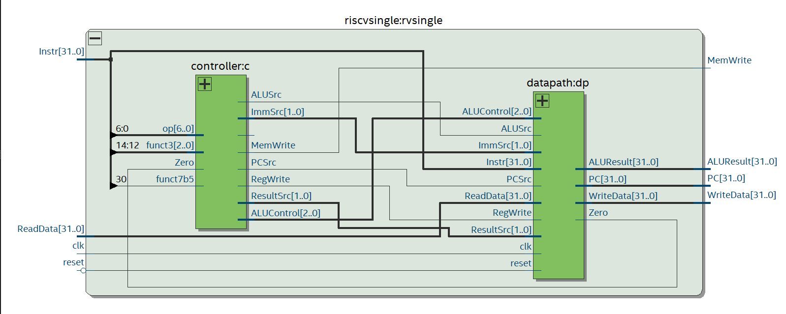
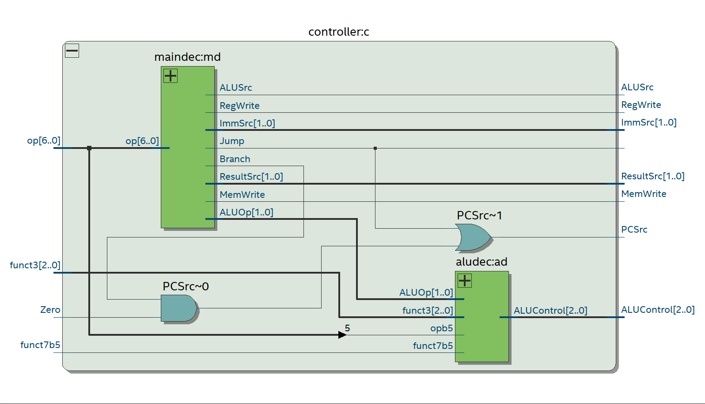
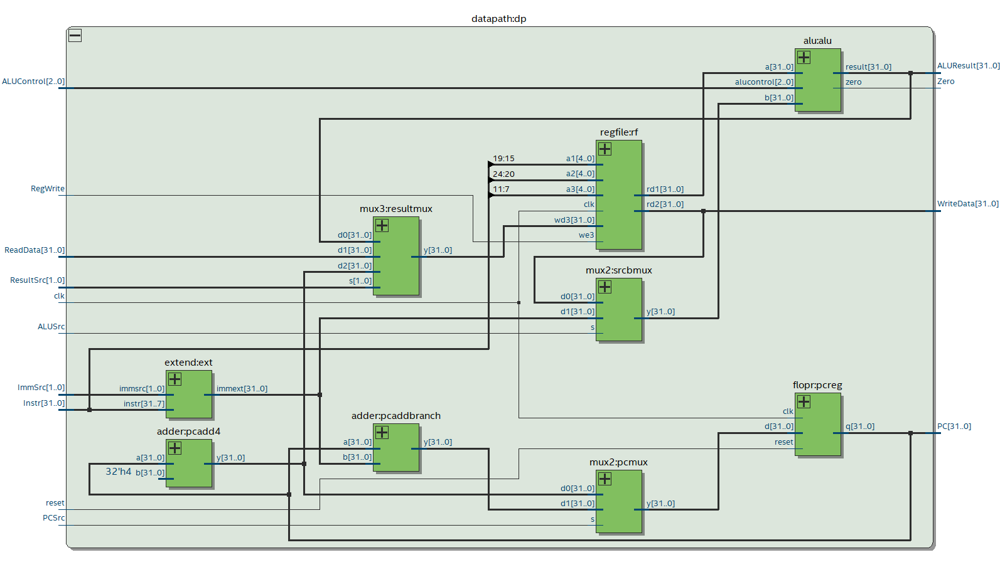
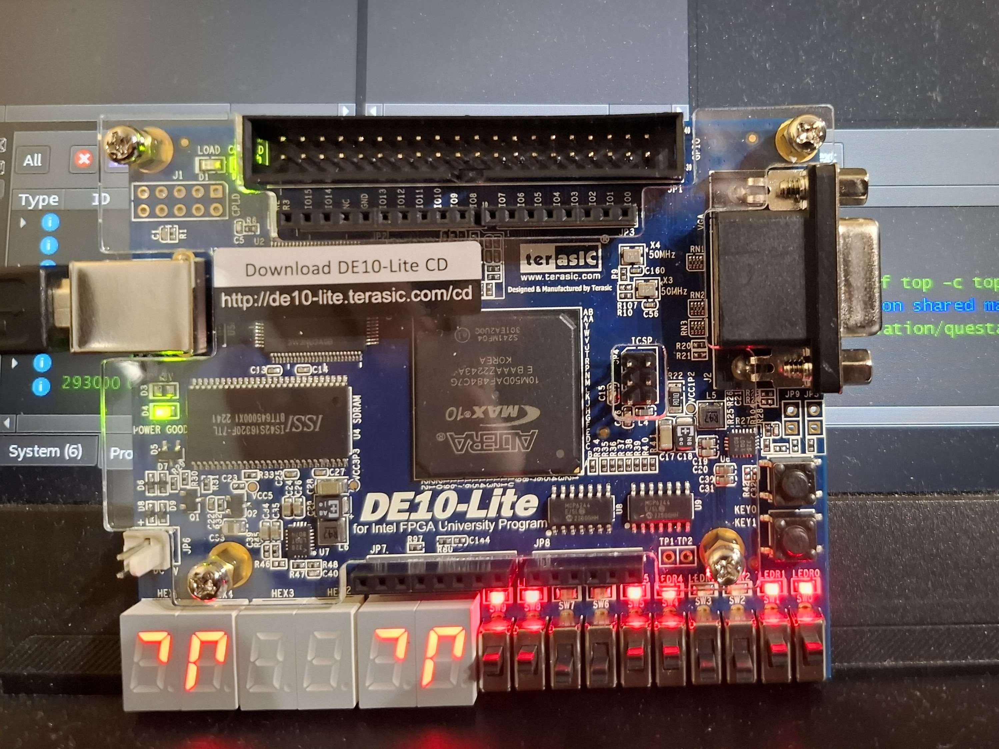
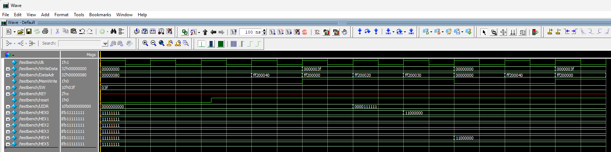

# Single-Cycle RISC-V Processor

A single-cycle RISC-V (RV32I subset) processor implemented in **SystemVerilog** based on designs from Harris & Harris's *Digital Design and Computer Architecture: RISC-V Edition*. The processor is designed to run on an **Intel DE10-Lite FPGA board** and includes memory-mapped I/O for switches, LEDs, and seven-segment displays.

## Overview

Every instruction completes the following stages in one clock cycle without pipelining:
 
```text
imem.txt (program)
  ↓
Fetch         PC → imem → Instr
  ↓
Decode        controller → control signals
  ↓
Execute       registers + immediate → ALU
  ↓
Memory        dmem.txt / MMIO read or write
  ↓
Writeback     result → register file
```
 
A store to a memory-mapped address (`LEDR`, `HEX0`–`HEX5`) during the memory stage is what drives the FPGA's physical outputs — writeback only ever affects the register file.

## Supported Instructions

| Type | Instructions |
| --- | --- |
| R-type | `add`, `sub`, `and`, `or`, `slt` |
| I-type ALU | `addi`, `andi`, `ori`, `slti` |
| Load / Store | `lw`, `sw` |
| Branch / Jump | `beq`, `jal` |

> The ALU also contains support for additional operations such as `xor`, `sll` (shift left logical), and `srl` (shift right logical). However, the decoder for the ALU (`aludec`) only generates control codes for the instructions in the table above, so no instruction encoding can select them.

## Modules

```
top                top-level wiring to board
├── riscvsingle      the processor
│   ├── controller     generates datapath control signals
│   │   ├── maindec        main decoder — opcode → control signals
│   │   └── aludec         decodes ALU operation
│   └── datapath       move and process data
│       ├── flopr          PC register
│       ├── adder          PC+4 and branch target
│       ├── mux2           PC mux
│       ├── regfile        32 × 32-bit register file, x0 = 0
│       ├── extend         immediate sign-extension
│       ├── mux2           ALU src-B mux
│       ├── alu            arithmetic logic unit
│       └── mux3           result mux
├── imem           instruction memory — 64 words, from imem.txt
└── dmem           data memory — 64 words, from dmem.txt
```

## RTL Schematics

Generated with Quartus's RTL Viewer.
 

*The processor (`riscvsingle`) — controller and datapath wired together*


*Controller — `maindec` and `aludec` producing the datapath's control signals*


*Datapath — PC logic, register file, ALU, and result muxes*

Full schematics can be viewed in [`RTL-schematic-view.pdf`](images/RTL-schematic-view.pdf).

## Memory-Mapped I/O

DE10-Lite peripherals are accessed through memory-mapped addresses.

| Address | Peripheral | Direction | 
| --- | --- | --- |
| `0xFF200000` | `LEDR[9:0]` — 10 LEDs | Write |
| `0xFF200020` | `HEX3HEX0` — 4 seven-segment displays | Write |
| `0xFF200030` | `HEX5HEX4` — 2 seven-segment displays | Write | 
| `0xFF200040` | `SW[9:0]` — 10 switches | Read | 

The CPU accesses these peripherals using the `lw` and `sw` instructions.

## Sample Program

The included [`sampleProgram.s`](sampleProgram.s) continuously reads the FPGA switches and mirrors their value onto the LEDs. It also writes the switch values directly into `HEX3HEX0` and `HEX5HEX4` as raw segment data.

To run this on the CPU, the program is split across two files, [`imem.txt`](imem.txt) and [`dmem.txt`](dmem.txt):

- [`imem.txt`](imem.txt) contains the executable machine-code instructions
- [`dmem.txt`](dmem.txt) contains the initial contents of data memory

The machine-code instructions are stored in [`imem.txt`](imem.txt):
 
| imem.txt | sampleProgram.s | Function |
| --- | --- | --- |
| `08002283` | `lw t0, BASE_PTR(zero)` | t0 = MMIO base address (0xFF200000) |
| `0402a303` | `lw t1, SW_OFFSET(t0)` | t1 = SW[9:0] |
| `0062a023` | `sw t1, LEDR_OFFSET(t0)` | LEDR[9:0] = t1 |
| `0262a023` | `sw t1, HEX3_OFFSET(t0)` | HEX3HEX0 = t1 |
| `0262a823` | `sw t1, HEX5_OFFSET(t0)` | HEX5HEX4 = t1 |
| `fe0008e3` | `beq x0, x0, loop` | repeat forever |

The MMIO base address is stored in [`dmem.txt`](dmem.txt):

| dmem.txt | sampleProgram.s | Function |
| --- | --- | --- |
| `00000000` | — | padding (× 32, out to word `0x80`) |
| `ff200000` | `BASE_ADDR: .word 0xFF200000` | MMIO base address, loaded into t0 above |

> The first `lw` instruction in `imem.txt` reads the `ff200000` word at `0x80` from `dmem.txt` as data to set up `t0`.

## FPGA Synthesis

Targets the Intel DE10-Lite pinout (`MAX10_CLK1_50`, `SW`, `KEY`, `LEDR`, `HEX0`–`HEX5`).

To synthesize the design in Quartus:
 
1. Create a new Quartus project targeting the DE10-Lite device
2. Add [`top.sv`](top.sv) to the project
3. Ensure [`imem.txt`](imem.txt) and [`dmem.txt`](dmem.txt) are in the project directory
4. Assign pins for your board (if necessary)
5. Compile the design
6. Program the generated `.sof` file onto the FPGA board


*A DE10-Lite running the sample program*

## Simulation

Verified in Questa 2024.3 (bundled with Quartus Prime Lite):

1. Create a new Questa project containing [`top.sv`](top.sv) and [`testbench.sv`](testbench.sv)
2. Ensure [`imem.txt`](imem.txt) and [`dmem.txt`](dmem.txt) are in the project directory
3. Compile the files
4. Start the simulation with accessibility flags:
   ```tcl
   vsim -gui work.testbench -voptargs=+acc=npr
   ```
5. Add the desired signals to the waveform viewer
6. Run the simulation:
   ```tcl
   run -all
   ```

On every `MemWrite`, the testbench logs the time, address, and data to the transcript, and stops the simulation once it logs a write past `t = 100ns`.


*Waveforms from running the sample program in the testbench*

## Files
 
| File / folder | Description |
| --- | --- |
| [top.sv](top.sv) | Full CPU design (all modules) |
| [testbench.sv](testbench.sv) | Simulation testbench |
| [sampleProgram.s](sampleProgram.s) | Demo assembly program |
| [imem.txt](imem.txt) | Assembled program, loaded into instruction memory |
| [dmem.txt](dmem.txt) | Initial data memory contents |
| [images/](images/) | RTL schematics & demo images |